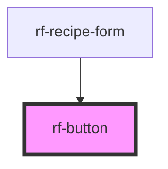

<!-- Auto Generated Below -->

## Overview

Shared accessible button primitive.

## Properties

| Property    | Attribute    | Description                               | Type                                              | Default     |
| ----------- | ------------ | ----------------------------------------- | ------------------------------------------------- | ----------- |
| `ariaLabel` | `aria-label` | Accessible name when content is icon-only | `string \| undefined`                             | `undefined` |
| `disabled`  | `disabled`   | Disabled state                            | `boolean`                                         | `false`     |
| `type`      | `type`       | Native button type                        | `"button" \| "reset" \| "submit"`                 | `'button'`  |
| `variant`   | `variant`    | Visual style                              | `"danger" \| "ghost" \| "primary" \| "secondary"` | `'primary'` |

## Events

| Event     | Description                                                       | Type                |
| --------- | ----------------------------------------------------------------- | ------------------- |
| `rfClick` | Emitted on activation (no DOM event in detail — host owns intent) | `CustomEvent<void>` |

## Slots

| Slot | Description            |
| ---- | ---------------------- |
|      | Button label / content |

## Dependencies

### Used by

 - [rf-recipe-form](../rf-recipe-form)

### Graph

----------------------------------------------

*Built with [StencilJS](https://stenciljs.com/)*
