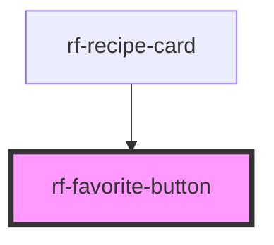

<!-- Auto Generated Below -->

## Overview

Accessible favorite (heart) toggle button.

## Properties

| Property        | Attribute        | Description                    | Type      | Default                   |
| --------------- | ---------------- | ------------------------------ | --------- | ------------------------- |
| `active`        | `active`         | Whether the item is favorited  | `boolean` | `false`                   |
| `disabled`      | `disabled`       | Disabled state                 | `boolean` | `false`                   |
| `labelActive`   | `label-active`   | Accessible label when active   | `string`  | `'Remove from favorites'` |
| `labelInactive` | `label-inactive` | Accessible label when inactive | `string`  | `'Add to favorites'`      |

## Events

| Event      | Description                            | Type                                |
| ---------- | -------------------------------------- | ----------------------------------- |
| `rfToggle` | Emitted when the user toggles favorite | `CustomEvent<{ active: boolean; }>` |

## Dependencies

### Used by

 - [rf-recipe-card](../rf-recipe-card)

### Graph

----------------------------------------------

*Built with [StencilJS](https://stenciljs.com/)*
