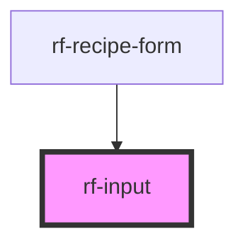

<!-- Auto Generated Below -->

## Overview

Labeled text input with optional error and hint slot.

## Properties

| Property       | Attribute      | Description                       | Type                  | Default     |
| -------------- | -------------- | --------------------------------- | --------------------- | ----------- |
| `autocomplete` | `autocomplete` | Autocomplete hint                 | `string \| undefined` | `undefined` |
| `disabled`     | `disabled`     | Disabled                          | `boolean`             | `false`     |
| `error`        | `error`        | Error message (sets aria-invalid) | `string \| undefined` | `undefined` |
| `label`        | `label`        | Visible label                     | `string`              | `''`        |
| `name`         | `name`         | Name attribute                    | `string \| undefined` | `undefined` |
| `placeholder`  | `placeholder`  | Placeholder                       | `string`              | `''`        |
| `required`     | `required`     | Required                          | `boolean`             | `false`     |
| `type`         | `type`         | Input type                        | `string`              | `'text'`    |
| `value`        | `value`        | Controlled value                  | `string`              | `''`        |

## Events

| Event      | Description                     | Type                  |
| ---------- | ------------------------------- | --------------------- |
| `rfChange` | Emitted on change / blur commit | `CustomEvent<string>` |
| `rfInput`  | Emitted on every input          | `CustomEvent<string>` |

## Slots

| Slot     | Description                          |
| -------- | ------------------------------------ |
| `"hint"` | Optional helper text below the field |

## Dependencies

### Used by

 - [rf-recipe-form](../rf-recipe-form)

### Graph

----------------------------------------------

*Built with [StencilJS](https://stenciljs.com/)*
