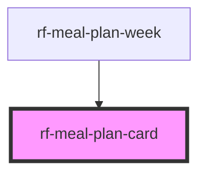

<!-- Auto Generated Below -->

## Overview

Single planned meal cell for the week planner.

## Properties

| Property                | Attribute   | Description                                                                                                          | Type                                                          | Default     |
| ----------------------- | ----------- | -------------------------------------------------------------------------------------------------------------------- | ------------------------------------------------------------- | ----------- |
| `day` _(required)_      | `day`       | Day of week                                                                                                          | `"fri" \| "mon" \| "sat" \| "sun" \| "thu" \| "tue" \| "wed"` | `undefined` |
| `meal`                  | `meal`      | Planned meal (optional when empty slot)                                                                              | `PlannedMeal \| string \| undefined`                          | `undefined` |
| `mealSlot` _(required)_ | `meal-slot` | Meal slot (breakfast / lunch / dinner). Uses attribute `meal-slot` to avoid clashing with the HTML `slot` attribute. | `"breakfast" \| "dinner" \| "lunch"`                          | `undefined` |

## Events

| Event      | Description                                    | Type                                                                              |
| ---------- | ---------------------------------------------- | --------------------------------------------------------------------------------- |
| `rfRemove` | Emitted when remove is clicked                 | `CustomEvent<{ meal: PlannedMeal; }>`                                             |
| `rfSelect` | Emitted when the meal / empty slot is selected | `CustomEvent<{ day: MealDay; slot: MealSlot; meal?: PlannedMeal \| undefined; }>` |

## Dependencies

### Used by

 - [rf-meal-plan-week](../rf-meal-plan-week)

### Graph

----------------------------------------------

*Built with [StencilJS](https://stenciljs.com/)*
