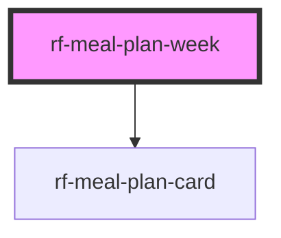

<!-- Auto Generated Below -->

## Overview

Seven-day meal planner grid.

## Properties

| Property    | Attribute    | Description                      | Type                      | Default |
| ----------- | ------------ | -------------------------------- | ------------------------- | ------- |
| `meals`     | `meals`      | Planned meals for the week       | `PlannedMeal[] \| string` | `[]`    |
| `weekStart` | `week-start` | ISO date for week start (Monday) | `string`                  | `''`    |

## Events

| Event          | Description                                                                                 | Type                                                                              |
| -------------- | ------------------------------------------------------------------------------------------- | --------------------------------------------------------------------------------- |
| `rfMealMove`   | Emitted when a meal should move (drag/drop or host-driven); detail includes source + target | `CustomEvent<{ mealId: string; toDay: MealDay; toSlot: MealSlot; }>`              |
| `rfMealRemove` | Emitted when a meal is removed                                                              | `CustomEvent<{ meal: PlannedMeal; }>`                                             |
| `rfSlotClick`  | Emitted when an empty or filled slot is clicked                                             | `CustomEvent<{ day: MealDay; slot: MealSlot; meal?: PlannedMeal \| undefined; }>` |

## Slots

| Slot       | Description                                     |
| ---------- | ----------------------------------------------- |
| `"header"` | Optional header content (week navigation, etc.) |

## Dependencies

### Depends on

- [rf-meal-plan-card](../rf-meal-plan-card)

### Graph

----------------------------------------------

*Built with [StencilJS](https://stenciljs.com/)*
