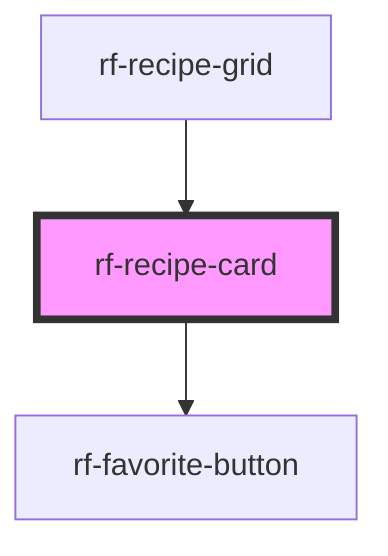

<!-- Auto Generated Below -->

## Overview

Recipe summary card.

## Properties

| Property              | Attribute       | Description                            | Type                           | Default     |
| --------------------- | --------------- | -------------------------------------- | ------------------------------ | ----------- |
| `favorited`           | `favorited`     | Whether this recipe is favorited       | `boolean`                      | `false`     |
| `hideFavorite`        | `hide-favorite` | Hide the built-in favorite control     | `boolean`                      | `false`     |
| `recipe` _(required)_ | `recipe`        | Recipe summary (object or JSON string) | `RecipeSearchResult \| string` | `undefined` |

## Events

| Event              | Description                                    | Type                                                            |
| ------------------ | ---------------------------------------------- | --------------------------------------------------------------- |
| `rfFavoriteToggle` | Emitted when favorite is toggled from the card | `CustomEvent<{ recipe: RecipeSearchResult; active: boolean; }>` |
| `rfRecipeSelect`   | Emitted when the card body is activated        | `CustomEvent<{ recipe: RecipeSearchResult; }>`                  |

## Slots

| Slot        | Description                    |
| ----------- | ------------------------------ |
| `"actions"` | Optional extra action controls |
| `"badge"`   | Optional badge overlay content |

## Dependencies

### Used by

 - [rf-recipe-grid](../rf-recipe-grid)

### Depends on

- [rf-favorite-button](../rf-favorite-button)

### Graph

----------------------------------------------

*Built with [StencilJS](https://stenciljs.com/)*
