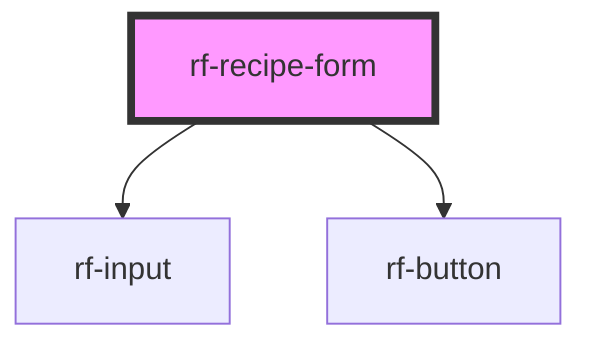

<!-- Auto Generated Below -->

## Overview

Presentational create/edit recipe form. Validation messages come from the host via `errors`.

## Properties

| Property      | Attribute      | Description                     | Type                                                                                                                                                                                          | Default         |
| ------------- | -------------- | ------------------------------- | --------------------------------------------------------------------------------------------------------------------------------------------------------------------------------------------- | --------------- |
| `disabled`    | `disabled`     | Disable submit                  | `boolean`                                                                                                                                                                                     | `false`         |
| `errors`      | `errors`       | Field-level errors from the app | `"area" \| "category" \| "cookTimeMinutes" \| "description" \| "form" \| "ingredients" \| "instructions" \| "prepTimeMinutes" \| "servings" \| "tags" \| "thumbnailUrl" \| "title" \| string` | `{}`            |
| `submitLabel` | `submit-label` | Submit button label             | `string`                                                                                                                                                                                      | `'Save recipe'` |
| `value`       | `value`        | Form draft value                | `UserRecipeDraft \| string`                                                                                                                                                                   | `emptyDraft()`  |

## Events

| Event      | Description                                     | Type                           |
| ---------- | ----------------------------------------------- | ------------------------------ |
| `rfChange` | Emitted on any field change with the full draft | `CustomEvent<UserRecipeDraft>` |
| `rfSubmit` | Emitted on submit                               | `CustomEvent<UserRecipeDraft>` |

## Slots

| Slot       | Description                               |
| ---------- | ----------------------------------------- |
| `"footer"` | Extra actions (cancel, secondary buttons) |

## Dependencies

### Depends on

- [rf-input](../rf-input)
- [rf-button](../rf-button)

### Graph

----------------------------------------------

*Built with [StencilJS](https://stenciljs.com/)*
