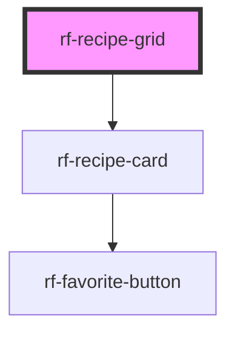

<!-- Auto Generated Below -->

## Overview

Responsive grid of recipe cards. Card events bubble as custom events from this host.

## Properties

| Property       | Attribute       | Description                   | Type                             | Default     |
| -------------- | --------------- | ----------------------------- | -------------------------------- | ----------- |
| `favoritedIds` | `favorited-ids` | Favorited recipe ids          | `string \| string[]`             | `[]`        |
| `label`        | `label`         | Accessible label for the grid | `string`                         | `'Recipes'` |
| `recipes`      | `recipes`       | Recipes to render             | `RecipeSearchResult[] \| string` | `[]`        |

## Events

| Event              | Description             | Type                                                            |
| ------------------ | ----------------------- | --------------------------------------------------------------- |
| `rfFavoriteToggle` | Bubbled favorite toggle | `CustomEvent<{ recipe: RecipeSearchResult; active: boolean; }>` |
| `rfRecipeSelect`   | Bubbled recipe select   | `CustomEvent<{ recipe: RecipeSearchResult; }>`                  |

## Slots

| Slot      | Description                             |
| --------- | --------------------------------------- |
| `"empty"` | Content shown when there are no recipes |

## Dependencies

### Depends on

- [rf-recipe-card](../rf-recipe-card)

### Graph

----------------------------------------------

*Built with [StencilJS](https://stenciljs.com/)*
